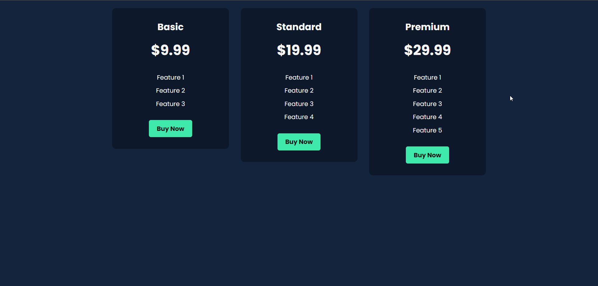

# Responsive pricing cards with different pricing tiers 

This code will create three responsive pricing cards with different pricing tiers (Basic, Standard, and Premium). Each card will have a title, price, list of features, and a "Buy Now" button. The cards will be displayed in a flex container with responsive spacing. Feel free to customize the styles further based on your design preferences.

# Demo 
## live Demo :
-  [Click here](https://dinil-thilakarathne.github.io/components/responsive-pricing-card)

## Project Preview

## Keep with touch

- YouTube : [@sonacode]("https://www.youtube.com/@sonacode/videos")
- GitHub : [Dinil Thilakarathne]("https://github.com/Dinil-Thilakarathne/")
- Instagram : [@sona_code]("https://www.instagram.com/sona_code/")